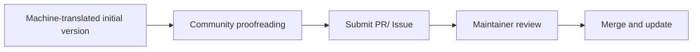

# War of Dawn — Language Localization Repository

This repository maintains the multilingual translation files for in-game text of Command & Conquer: War of Dawn.

The translation adopts a AI translation + community proofreading model: the initial version is generated by AI, and subsequent improvements, polishing, and refinement come from community contributors.

> 📌 **Special Note**：Classical Chinese translation is an experimental feature of this MOD, and we welcome all feedback and polishing.

## 📁 Directory Structure
Translations/

├── en/ # English

├── zh-Hans/ # Simplified Chinese (source language)

└── zh-hant/ # Classical Chinese (Traditional script)

- `en/` — English version

- `zh-Hans/` — Simplified Chinese version, used as the **reference source** for other languages

- `zh-hant/` — Classical Chinese version (using Traditional Chinese characters)

## 🌐 语言状态

| 语言 | 代码 | 目录 | 状态 |
|------|------|------|------|
| English | `en` | `/en` | 🟡 Machine-translated initial version, pending proofreading |
| 简体中文 | `zh-Hans` | `/zh-Hans` | 🟢 Source language|
| 文言文 | `zh-hant` | `/zh-hant` | 🟡 Machine-translated initial version, pending proofreading |

> 🟢 Completed  🟡 In progress 🔴 Not started

## 📄 File Format

Each language directory mirrors the game's internal text entry structure. Each file contains key-value pairs in LLF format:

For .csf files, edit them using a CSF editor.

**Do not modify the keys**– only edit the translated content.

## 🤝 How to Contribute

Anyone is welcome to participate in translation proofreading! No programming knowledge is required – you only need to edit text files.

### Option 1: Submit a Pull Request (Recommended)

1.Fork this repository.

2.Locate the file you want to modify in the corresponding language directory.

3.Edit the translation content.

4.Submit a Pull Request describing your changes.

### Option 2: Submit an Issue

If you prefer not to go through the PR process, you can also [submit an lssue](https://github.com/wenrui1245/CnC-WarofDawn-Language/issues) pointing out translation problems or suggesting changes.

### Option 3: Join the Player Community

You can also join the War of Dawn player QQ group and provide feedback on translation issues there. Group number: **1045447835**

## 📝 Translation Guidelines

1. **Only change values, never keys**：Do not modify key names.
2. **Preserve formatting**：Do not arbitrarily change file encoding or line endings.
3. **Maintain terminology consistency**：For terms that already have established in-game translations, keep them consistent throughout.
4. **Explain your changes**：In your PR or Issue, briefly state what you changed and why.

### Special Notes per Language

| Language | Guidelines |
|------|------|
| **English (en)** | Aim for fluency and naturalness; grammar must be correct and expressions should conform to English usage.  |
| **简体中文 (zh-Hans)** | This is the source language and usually does not require changes. If you find errors in the Chinese source, you may submit a PR to correct them.|
| **文言文 (zh-hant)** | Aim for elegance and conciseness. Draw from classical texts where appropriate. Literal word‑for‑word translation is not required; capturing the spirit and tone is more important. |

## 📋 Proofreading Workflow

## 📜 Contributor List

We thank the following contributors for their support of this translation project:

(to be added)

If you have submitted translation changes that have been merged, feel free to add your name to this list!

## 📄 License

The translation content in this repository is subject to the same license as Command & Conquer: War of Dawn. Refer to the main project documentation for details.

Thank you for participating! Every improvement to the translations helps more players enjoy a better gaming experience.
