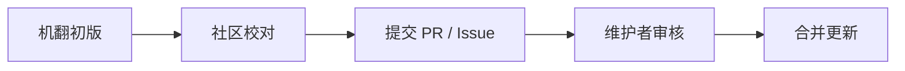

# 曙光之战 — 社区翻译

本仓库用于维护《命令与征服：曙光之战》游戏内文本的多语言翻译文件。

翻译采用 **机器翻译 + 社区校对** 的模式：初版由 AI 生成，后续依靠社区贡献者修正、润色和完善。

> 📌 **特别说明**：文言文翻译是本MOD的一项实验性内容，具体内容欢迎各位进行打磨。

## 📁 目录结构
Translations/

├── en/ # 英文

├── zh-Hans/ # 简体中文（源语言）

└── zh-hant/ # 文言文（繁体）

- `en/` — 英文版本

- `zh-Hans/` — 简体中文版本，作为其他语言翻译的 **参考源**

- `zh-hant/` — 文言文版本（使用繁体中文）

## 🌐 语言状态

| 语言 | 代码 | 目录 | 状态 |
|------|------|------|------|
| English | `en` | `/en` | 🟡 机翻初版，待校对 |
| 简体中文 | `zh-Hans` | `/zh-Hans` | 🟢 源语言 |
| 文言文 | `zh-hant` | `/zh-hant` | 🟡 机翻初版，待校对 |

> 🟢 已完成 🟡 进行中 🔴 待开始

## 📄 文件格式

每个语言目录下的文件结构与游戏内的文本条目一一对应。每个文件包含若干条键值对：(LLF格式)
KEY_001: 对应的翻译文本
KEY_002: 对应的翻译文本
  此键名的下一行翻译文本

对于.csf文件，使用csf编辑器进行编辑即可。

**（请勿修改键名）**，只修改翻译内容。

## 🤝 如何贡献

欢迎任何人参与翻译校对！无需具备编程知识，只需会修改文本文件即可。

### 方式一：提交 Pull Request（推荐）

1. Fork 本仓库。
2. 在对应的语言目录中找到需要修改的文件进行修改。
3. 修改翻译内容。
4. 提交 Pull Request，描述你的修改内容。

### 方式二：提交 Issue

如果不想走 PR 流程，也可以[提交 Issue](https://github.com/wenrui1245/CnC-WarofDawn-Language/issues)，指出翻译问题或建议修改。

### 方式三：加入玩家群反馈

你也可以直接加入曙光之战玩家 QQ 群，在群内反馈翻译问题。群号：**1045447835**

## 📝 翻译规范

1. **只改值，不改键**：不要修改键名。
2. **保持格式**：不要随意改动文件编码和换行符。
3. **术语统一**：游戏中已有译名的术语，请保持前后一致。
4. **注明原因**：在 PR 或 Issue 中简要说明修改了什么、为什么修改。

### 各语言特别说明

| 语言 | 说明 |
|------|------|
| **英文 (en)** | 以通顺、自然为原则，语法要正确，符合英语表达习惯。  |
| **简体中文 (zh-Hans)** | 源语言，通常不需要修改。如有中文原文错误，可提交 PR 修正。|
| **文言文 (zh-hant)** | 以典雅、简练为原则，可参考古籍用语。不求逐字对译，但求意境相符。 |

## 📋 校对流程

## 📜 贡献者名单

感谢以下贡献者对本翻译项目的支持（按首字母排序）：

（待补充）

如果你提交了翻译修改并被合并，欢迎将你的名字添加到这个名单中！

## 📄 许可证

本仓库翻译内容遵循与《命令与征服：曙光之战》相同的许可证。详见主项目说明文档。

感谢你的参与！ 每一处翻译的改进，都能让更多玩家享受更好的游戏体验。
